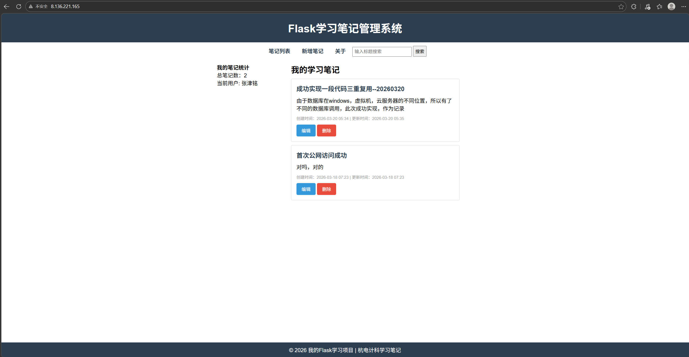

# 📝 笔记管理系统
基于 Flask + MySQL + Docker 开发的全栈笔记管理平台，已部署至阿里云公网可访问。

## ✨ 功能
- 用户注册 / 登录
- 笔记增删改查
- 搜索功能
- 响应式页面
- RESTful API
- JWT 身份认证

## 🛠 技术栈
- Python Flask
- MySQL / SQLite
- SQLAlchemy ORM
- JWT 登录验证
- Bootstrap 前端
- Docker 容器化
- 阿里云 ECS 部署

## 🚀 线上演示
http://8.136.221.165

## 📌 项目亮点
1. 一套代码跨平台：Windows / 虚拟机 / 云服务器通用
2. 自动适配数据库：本地 SQLite，部署 MySQL
3. 容器化部署，环境零差异
4. 完整前后端 + 接口 + 部署全流程

## 🧑‍💻 开发者
张津铭

## 📷 项目截图


## 基础信息
- 接口前缀：http://127.0.0.1:5000/api
- 数据格式：所有请求/响应均为JSON
- 统一响应格式：
  ```json
  {
      "code": 状态码（200成功/400参数错/404不存在）,
      "message": "提示信息",
      "data": "核心数据（笔记/列表/空）",
      "timestamp": "时间戳"
  }

## 接口列表
### 1.获取所有笔记
- 请求方式：GET
- 接口路径：/notes
- 返回数据示例：
  ```json
  {
      "code": 200,
      "message": "获取笔记成功",
      "data": [
          {"id": 1, "title": "标题1", "content": "内容1"},
          {"id": 2, "title": "标题2", "content": "内容2"}
      ],
      "timestamp": "2023-04-01T08:00:00Z"
  }

### 2.新增笔记
- 请求方式：POST
- 接口路径：/note
- 请求参数（JSON）：
  ```json
  {
      "title": "新标题",
      "content": "新内容"
  }
- 返回数据示例：
  ```json
  {
      "code": 200,
      "message": "添加笔记成功",
      "data": {"id": 3, "title": "新标题", "content": "新内容"},
      "timestamp": "2

### 3.修改笔记
- 请求方式：PUT
- 接口路径：/note/{id}
- 请求参数（JSON）：
  ```json
  {
    "title": "修改后的标题",
    "content": "修改后的内容"
  }
- 返回数据示例：
  ```json
  {
      "code": 200,
      "message": "修改笔记成功",
      "data": {"id": 1, "title": "修改后的标题", "content": "修改后的内容"},
      "timestamp": "2023-04-01T08:00:00Z"
  }

### 4.删除笔记
- 请求方式：DELETE
- 接口路径：/note/{id}
- 返回数据示例：
  ```json
  {
      "code": 200,
      "message": "删除笔记成功",
      "data": null,
      "timestamp": "2023-04-01T08:00:00Z"
  }

